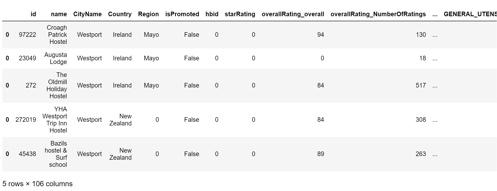
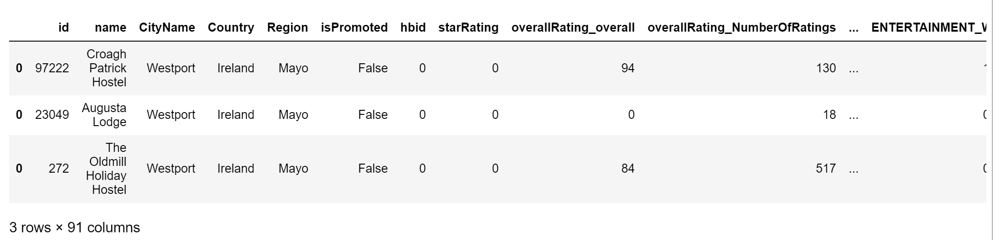
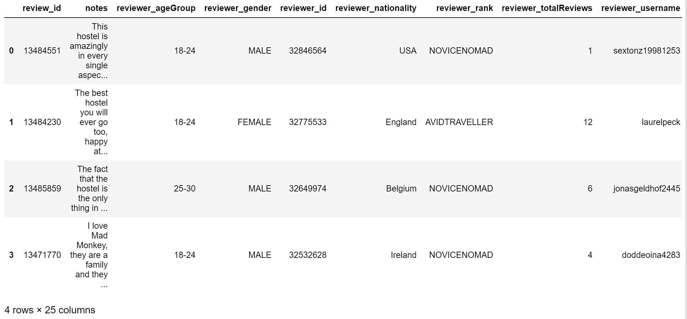

# py-hostelworld
> Unofficial hostelworld API created using Hostelworld.com endpoints.

## Table of contents
* [General Info](#general-info)
* [Technologies](#technologies)
* [Setup](#setup)
* [Usage Examples](#usage-examples)
* [Features](#features)
* [Status](#status)


## General Info
Over the last week, I have been working on a hostelworld/airbnb/booking.com aggregatator as I am building a web service that lets you find the cheapest accomodation close to your gps location (or set location). Personally, I love hostels. They're the best options for solo backpackers as they're as cheap as they can get, but, more importantly and more often than not, they are filled with likeminded people who are looking for the next adventure. In my second solo trip to South East Asia, I literally jumped between 20 different hostels in 35 days. Why so many in such a short time? I wanted to check out as many hostels as possible so that during my next 'perfect' trip, I would know which palaces to go back to and which ones to avoid. Nevertheless, all of them were unique in their own way.
Me being me, it is only natural that I would look into how many actual hostels are out there and analyse the data to see if I can gain some useful insights. Building this API is hte first step of that process.

## Technologies
The code is written in python comprinsing a collection of REST calls.

## Setup
- After cloning the repo. pip install the requirements.txt.
- Following the above changes, you can execute the script via terminal: python main.py

## Usage Examples
Instantiate the class
```python
hw = Hostelworld()
```
Show me all the hostels in South Africa
```python
hw.get_hostel_by_country_name('South Africa')
```


Show me all the hostels in Hanoi
```python
hw.get__hostel_by_city_name('Hanoi')
```


Sometimes countries like to name their cities with city names already present in other countries. 
```python
hw.get__hostel_by_city_name_multiple_locations('Westport')
```


But what if we only want to see the results in Ireland?
```python
hw.get__hostel_by_city_name_multiple_locations('Westport','Ireland')
```


If we want to check out reviews for a single hostel we have to insert the hostel_id that we get from any of the previous methods
```python
hw.get_hostel_review_by_hostel_id(100962)
```


Ok. We've decided that we want to check out that hostel. Is it available? We check availability by choosing check-in date and how long we plan on staying.
```python
hostel_id = 100962
start_date = '2021-06-23'
n_nights=10 #max value 30
hw.get_hostel_availability_by_hostel_id_date(hostel_id,start_date,n_nights).T
```


## Features
List of features ready and TODOs for future development
* get_hostel_by_country_name
* get__hostel_by_city_name
* get__hostel_by_city_name_multiple_locations
* get_hostel_review_by_hostel_id
* get_hostel_availability_by_hostel_id_date

To-do list:
* ~~Check hostels' availability given defined timeframe~~
* ~~Get hostels' reviews~~ Include, city_name, country_name, hostel_name, hostel_id in response dataframe
* Upload package to pypi.org
* create swagger endpoints
* Store places id in mongodb file (currently saved in csv).
* Replace requests with sessions and Retry objects.

## Status
Project is: _in progress_


